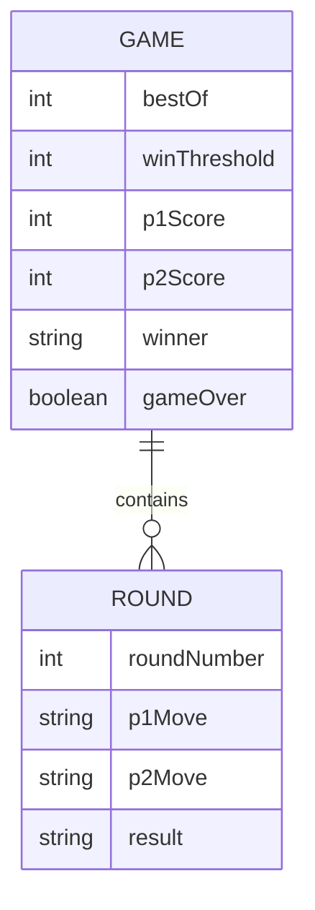

# Data Model & Schema

This documentation provides a comprehensive overview of the entities, attributes, and relationships within the Rock Paper Scissors engine, following industry standards similar to MongoDB and Flask documentation.

## Entity-Relationship Overview

The system is designed around two primary entities: the **Game Session** and the **Round**.



## Detailed Schema Specification

### 1. Game Entity (`RPSGame` class)
The root entity that manages the state of a "Best of N" match.

| Attribute | Data Type | Validation Rules | Description |
|-----------|-----------|------------------|-------------|
| `bestOf` | `Integer` | `> 0`, `< 100`, `isOdd` | The total number of rounds possible in the session. |
| `winThreshold` | `Integer` | `ceil(bestOf / 2)` | The number of round wins required to end the game. |
| `p1Score` | `Integer` | `min: 0` | Cumulative wins for Player 1. |
| `p2Score` | `Integer` | `min: 0` | Cumulative wins for Player 2. |
| `gameOver` | `Boolean` | Default: `false` | Becomes `true` once a player reaches the `winThreshold`. |
| `winner` | `String` | `enum: ['p1', 'p2', null]` | Identifies the winner of the entire session. |

### 2. Round Entity (`roundData` object)
Represents a discrete interaction within a Game Session.

| Attribute | Data Type | Validation Rules | Description |
|-----------|-----------|------------------|-------------|
| `roundNumber` | `Integer` | `auto-increment` | The index of the round in the `rounds` array. |
| `p1Move` | `String` | `enum: ['rock', 'paper', 'scissors']` | The move chosen by Player 1. |
| `p2Move` | `String` | `enum: ['rock', 'paper', 'scissors']` | The move chosen by Player 2. |
| `result` | `String` | `enum: ['p1', 'p2', 'draw']` | The outcome determined by the engine logic. |

## JSON Object Mapping (Flask/MongoDB Style)

When the game state is serialized (e.g., for API responses or database storage), it follows this nested structure:

```json
{
  "_id": "507f1f77bcf86cd799439011",
  "metadata": {
    "version": "1.0.0",
    "timestamp": "2026-04-22T14:00:00Z"
  },
  "session": {
    "config": {
      "best_of": 3,
      "win_threshold": 2
    },
    "state": {
      "p1_score": 2,
      "p2_score": 1,
      "is_finished": true,
      "final_winner": "p1"
    },
    "history": [
      { "round": 1, "p1": "rock", "p2": "scissors", "winner": "p1" },
      { "round": 2, "p1": "paper", "p2": "scissors", "winner": "p2" },
      { "round": 3, "p1": "scissors", "p2": "paper", "winner": "p1" }
    ]
  }
}
```
